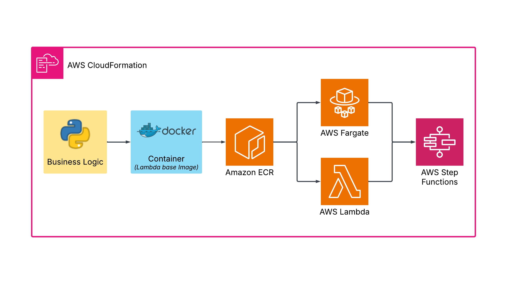

# aws-fargate-step-function-cloud-formation
Small repo that creates an AWS Step Function to call Fargate tasks with cloud formation.


This repo follows from this [repo](https://github.com/daniel-fudge/aws-fargate-step-function-demo) 
which also deployed an AWS Step Function that calls Fargate tasks. However that repo 
performed this with AWS CLI commands. This repo creates the same infrastructure but with 
the AWS Cloud Formation (CF) Infrastrucutre as Code (IaC).

We'll first create a stack with just the task to test it's functionality. Then create a 
second stack with a Step Function that calls the tasks. This stack can be quickly modified 
to call a Lambda function that leverages the same ECR image like the previous 
[repo](https://github.com/daniel-fudge/aws-fargate-step-function-demo). Here are the steps 
we'll be following.
1. Setup the environment
1. Create and Publish Container to ECR
1. Create the VPC and Fargate Task
1. Add a Step Function to the Stack
1. References

## 1. Setup the Environment
### Configure the AWS Console
Before completing the following CLI command, you need to install the AWS CLI and configure 
it for the account, role and region you wish to use. I use the `aws configure sso` command.

### First set some environment variables
```shell
export AWS_ACCOUNT_ID=[ENTER YOUR AWS ACCOUNT ID HERE]
export AWS_PROFILE=[ENTER YOUR CLI PROFILE NAME HERE]
export BUCKET=[ENTER YOUR BUCKET NAME HERE]
export AWS_PAGER=""
export AWS_REGION=us-east-1
export IMAGE_NAME=timer
export IMAGE_TAG=v1
```

### Create S3 bucket and an ECR repository
Note you only have to do this once and you may also simply use an existing bucket and 
repo. Since you may want to keep S3 objects after the stack has been deleted, you can't 
make the bucket within the Cloudformation stack. You also can't push a Docker image into 
ECR through Cloudformation, so it has to be done before you deploy the Task stack that 
requires the ECR image. Therefore the ECR repo must also be created before the stack is 
deployed.

```shell
aws s3 mb s3://$BUCKET 
aws ecr create-repository --repository-name $IMAGE_NAME --region $AWS_REGION \
--image-scanning-configuration scanOnPush=true --image-tag-mutability MUTABLE
```

## 2. Create and Publish Container to ECR

### Commands to build image and verifiy that it was built
Note you need the Docker daemon installed to complete the following.
```shell
docker buildx build --platform linux/amd64 --provenance=false -t ${IMAGE_NAME}:${IMAGE_TAG} .
docker images 
```

#### Note
If trying to build mulitple times you may run out of disk space.   
`docker system df` will show the reclaimable disck space.   
`docker system prune -a` will delete all docker artifacts.   

### Authenticate Docker CLI with ECR
You should see `Login Succeeded` after this command.
```shell
aws ecr get-login-password --region $AWS_REGION | docker login --username AWS \
--password-stdin $AWS_ACCOUNT_ID.dkr.ecr.$AWS_REGION.amazonaws.com
```

### Give the image the `latest` tag
```shell
docker tag ${IMAGE_NAME}:${IMAGE_TAG} $AWS_ACCOUNT_ID.dkr.ecr.$AWS_REGION.amazonaws.com/${IMAGE_NAME}:latest
```

### Deploy Docker image to ECR
```shell 
docker push $AWS_ACCOUNT_ID.dkr.ecr.$AWS_REGION.amazonaws.com/${IMAGE_NAME}:latest
```

## 3. Create the VPC and Fargate Task
Create the stack and wait for it to be completed.
```shell
aws cloudformation create-stack --stack-name task --template-body file://task.yml \
--capabilities CAPABILITY_NAMED_IAM --disable-rollback \
--parameters ParameterKey=Bucket,ParameterValue=${BUCKET}
aws cloudformation wait stack-create-complete --stack-name task
```
To delete the stack and wait for it to be deleted:
```shell
aws cloudformation delete-stack --stack-name task
aws cloudformation wait stack-delete-complete --stack-name task
```

### Call the Fargate Task
The ouput of the deployed stack includes the command to run a task from the CLI. The 
command begins with `aws ecs run-task`. You can get this from the AWS console or you can
run the command below.

```shell
aws cloudformation list-exports --query "Exports[*].[Value]" --output text | grep run-task
```

## 4. Add a Step Function to the Stack
REMINDER: Delete the stack created in the previous step. This section will create a 
completely new stack and does not require the previous stack.

Create the stack and wait for it to be completed.
```shell
aws cloudformation create-stack --stack-name step --template-body file://step.yml \
--capabilities CAPABILITY_NAMED_IAM --disable-rollback \
--parameters ParameterKey=Bucket,ParameterValue=${BUCKET}
aws cloudformation wait stack-create-complete --stack-name step
```
To delete the stack and wait for it to be deleted:
```shell
aws cloudformation delete-stack --stack-name step
aws cloudformation wait stack-delete-complete --stack-name step
```

### Invoke the step function
```shell
sed "s/BUCKET/${BUCKET}/" step-input-fargate.json > temp.json
aws stepfunctions start-execution \
--state-machine-arn arn:aws:states:${AWS_REGION}:${AWS_ACCOUNT_ID}:stateMachine:${IMAGE_NAME}-fargate \
--input "$(cat temp.json)"
rm -f temp.json
```


## 5. References
 - [CLI Repo Version](https://github.com/daniel-fudge/aws-fargate-step-function-demo)    
 - [Cloud Formation Example Repo](https://github.com/nathanpeck/aws-cloudformation-fargate)    
 - [AWS Cloudformation CLI](https://awscli.amazonaws.com/v2/documentation/api/2.1.29/reference/cloudformation/index.html#cli-aws-cloudformation)
 - [AWS Cloudformation Template Reference](https://docs.aws.amazon.com/AWSCloudFormation/latest/UserGuide/template-reference.html)
